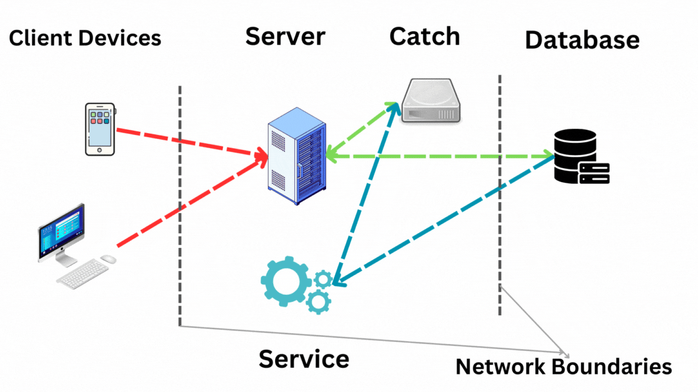

# Business Articles Web Application AI_NEWS

## Overview

This web application provides users with a platform to view recent articles related to business. The system efficiently fetches and displays articles through a dedicated service that runs every hour. To ensure high availability, the server responds to requests using a cache mechanism. If the cache is empty, the system fetches articles directly from the database, updating the cache in the process.

## Features

1. **Recent Articles Display:** The web application showcases recent business articles, providing users with up-to-date information.

2. **Automatic Article Fetching:** A dedicated service runs every hour to fetch new articles from the database, ensuring that the content remains current.

3. **Caching Mechanism:** The system maintains a cache to store recently fetched articles, reducing the response time by serving articles directly from the cache when possible.
   Catche is eliminate articles which are 24 hours or more older.

5. **High Availability:** The server optimizes availability by responding to requests using the cached articles. In the absence of cached data, it fetches from the database and updates the cache.

6. **Search Functionality:** Users can search for articles based on keywords, enhancing the overall user experience.

7. **Feedback Submission:** Users can provide feedback, suggestions, or report issues directly through the website. Feedback is sent to the owner's email address for prompt attention and response.

## Technologies Used

- **Frontend:**
  - HTML
  - CSS
  - JavaScript

- **Backend:**
  - Python
  - Flask (Web framework)
  - Jinja (Template engine)

# NEWSDATA.AI apis are used to fatch articles which are max older 24 hour.
